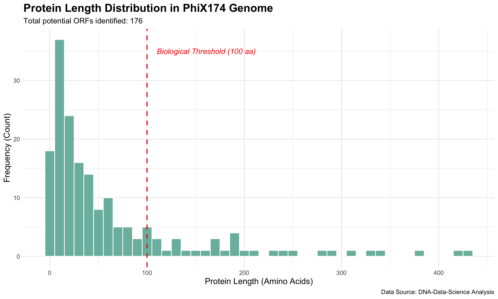

# DNA-Data-Science: Bioinformatics & Sequence Analysis

Repository of 14+ **Rosalind** solutions and high-performance genomic data analysis tools. This portfolio demonstrates the transition from fundamental biological algorithms to optimized production-grade sequence analysis.

## 🛠 Tech Stack
- **Languages:** Python 3.14 (Latest Features), R (ggplot2)
- **Key Libraries:** Biopython, Matplotlib, NetworkX
- **Methodology:** Algorithm optimization (O(N) complexity), neighborhood search, and memory caching.

---

## 🧬 Featured Analysis: ORF Discovery & Length Distribution
Identification of Open Reading Frames (ORFs) is a critical step in gene prediction. This tool scans both strands of DNA for start and stop codons to find potential protein-coding sequences.

### PhiX174 Case Study:
I analyzed the **PhiX174 bacteriophage genome** (the first-ever sequenced DNA) using a custom Python detector. The results were then processed in **R** to visualize the length distribution.

- **Total ORF candidates identified:** 176
- **Biological Insight:** The histogram shows a clear separation between short random sequences and real functional genes (generally >100 amino acids).

---

## 🚀 Featured Project: Ultra-Fast Genomic Marker Discovery
A specialized tool designed to identify unique regulatory motifs or genetic markers across multiple genomes.

### Key Capabilities:
- **Fuzzy Pattern Matching**: Finds markers even with mutations ($max\_err=1$) using a **Neighborhood Search** algorithm.
- **Performance Optimized**: Reduced processing time for the **PhiX174 genome** from 10s to <0.1s.
- **Cross-Genome Uniqueness**: Automatically verifies if a marker is unique to a specific organism compared to a local database.

### Algorithm Evolution
| Version | Approach | PhiX174 Speed | Key Tech |
| :--- | :--- | :--- | :--- |
| v1.0 | Brute Force | 10.0s | Simple loops |
| v2.0 | Hash Indexing | 2.0s | Python Dictionaries |
| **v3.0** | **Neighborhood Search** | **Instant** | **Pre-computed Mutations** |

---

## ✅ Rosalind Challenges (14+ Tasks)

### 🧬 Molecular Biology & Translation
- **INI, DNA, RNA, REVC**: Core nucleotide manipulation and transcription/translation.
- **PROT**: Protein translation simulation.
- **CONS**: Profile matrices and consensus sequence discovery.
- **ORF**: Open Reading Frame detection across 6 frames.

### 📊 Genetics, Evolution & Probability
- **GC**: Analysis of DNA thermal stability via Guanine-Cytosine content.
- **HAMM**: Evolutionary distance measurement via point mutations.
- **IPRB, IEV**: Mendelian inheritance and genotype distribution modeling.
- **FIB, FIBD**: Population dynamics using recursive relations and mortality models.

### 🔍 Sequence Analysis & Assembly
- **SUBS**: Substring motif searching.
- **GRPH**: Foundation of genome assembly using Overlap Graphs (De Bruijn logic).

---

## 🖼 Genomic Maps & Graphs
- **Genomic Marker Map:** [View PhiX174 Map](./results/phix174.png) — Distribution of unique 7-mers.
- **Overlap Graph (GRPH):** [View Graph](./data/plots/grph_graph.png) — Visualizing connectivity between DNA fragments.
- **Nucleotide Distribution (DNA):** [View Chart](./results/dna_distribution.png) — Quantitative analysis of A, C, G, and T frequencies.

---
*Educational Note: All scripts prioritize English documentation and follow a strict "performance-first" philosophy for bioinformatics data processing.*