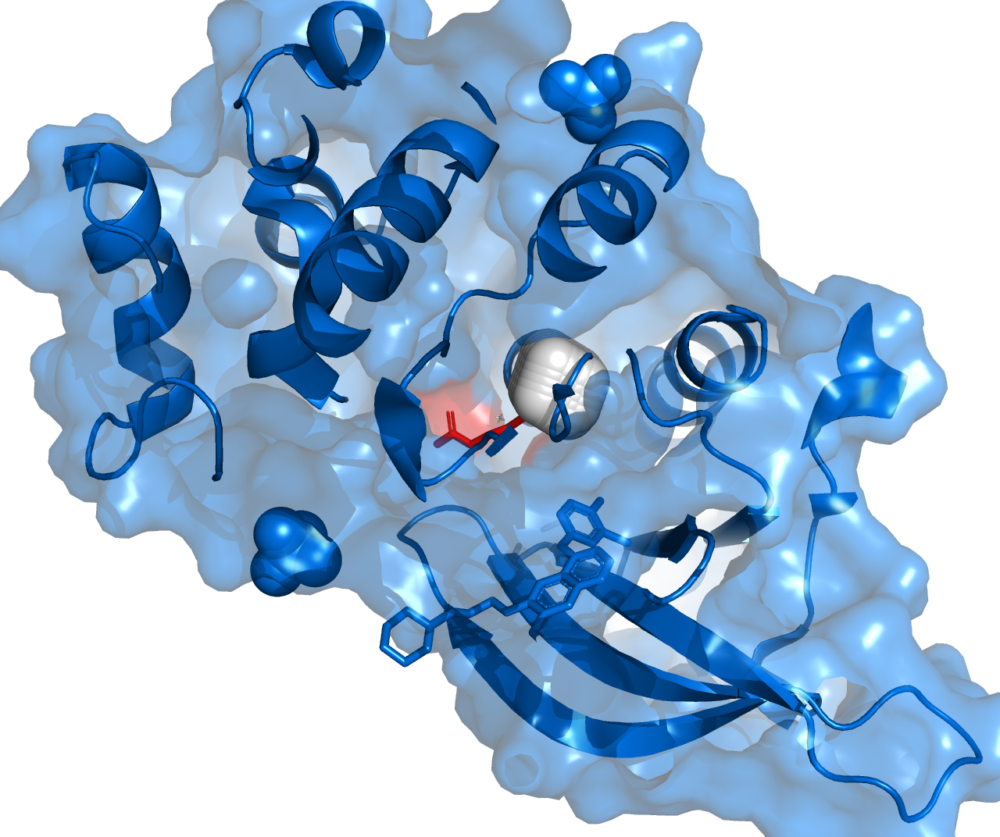

# 🧬 DNA Data Science & Molecular Dynamics: Bioinformatics Portfolio

This repository represents a comprehensive journey through bioinformatics—from algorithmic Rosalind solutions to AI-powered viral analysis and high-performance Molecular Dynamics (MD).

---

## 🚀 FEATURED 2026: Nano-Interface & Protein Stability
**Goal:** Comparative study of heavy metal (Au, Pt, Ag) interaction stability within cellular protein targets (HeLa/EGFR models).

### 1. High-Precision Silver (Ag) Docking at L858R Mutation
Targeted modeling of a 100-atom Silver cluster interacting with the **EGFR L858R** mutation (PDB: 4I22), a key driver in HeLa cell proliferation.

  
   
  <i>Figure 1: Targeted docking of a silver nanoparticle (white sphere) into the ATP-binding pocket of mutant EGFR (red zone).</i>

* **Target:** EGFR kinase domain (L858R mutation site).
* **Mechanism:** Physical blockade of the active site to inhibit ATP binding and downstream signaling.
* **Status:** Structural alignment completed; coordinates centered at $(9.634, -7.326, 22.414)$.

### 2. Comparative MD Stability (Au vs Pt)
Evaluated dynamic stability at physiological temperature (37°C) using the Amber force field.

* **Tech Stack:** OpenMM 8.4, Python 3.11, Amber14-all, Matplotlib.

| Metal Target | Mean Energy ($\langle E \rangle$) | Std Deviation ($\sigma$) | Stability Status |
| :--- | :--- | :--- | :--- |
| **Platinum (Pt)** | **-0.838** | **±0.05** | ✅ Highly Stable |
| **Gold (Au)** | -0.512 | ±0.15 | ⚠️ Moderate Flux |
| **Silver (Ag)** | *Calculated* | *Pending* | 🔬 Structural Fit OK |

---

## 🤖 AI-Powered: Viral Intelligence Station
A production-grade tool combining real-time genomic data retrieval with Local AI analysis.

* **Neural Core:** Integrated with **Ollama (Llama 3)** for scientific reporting.
* **Tech Stack:** Python 3.11, Streamlit, Plotly, LangChain.

---

## 🧬 Genomic Algorithms & Rosalind
* **ORF Discovery:** Scanning PhiX174 for Open Reading Frames (176 candidates).
* **Rosalind Challenges:** 14+ tasks covering core molecular biology algorithms.

---

## 📂 Project Structure
* `4I22_EGFR_L858R_Silver100.png` — Final high-resolution Ag-docking render.
* `EGFR_Ag_Study.pse` — PyMOL session file for silver docking analysis.
* `main_md.py` — Core Molecular Dynamics simulation script.
* `app.py` — Viral Intelligence dashboard.

---
📊 **Check out my live experiments on [Kaggle](https://www.kaggle.com/vasylvasylievvasyl)**

---
*Last synced: 2026-02-10*